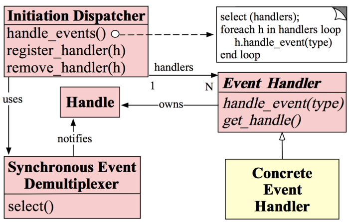

## Reactor

#### Reactor模式的角色构成(Reactor模式一共有5中角色构成)：

* Handle(句柄或描述符，在Windows下称为句柄，在Linux下称为描述符)：本质上表示一种资源(比如说文件描述符，或是针对网络编程中的socket描述符)，是由操作系统提供的；该资源用于表示一个个的事件，事件既可以来自于外部，也可以来自于内部；外部事件比如说客户端的连接请求，客户端发送过来的数据等；内部事件比如说操作系统产生的定时事件等。它本质上就是一个文件描述符，Handle是事件产生的发源地。

* Synchronous Event Demultiplexer(同步事件分离器)：它本身是一个系统调用，用于等待事件的发生(事件可能是一个，也可能是多个)。调用方在调用它的时候会被阻塞，一直阻塞到同步事件分离器上有事件产生为止。对于Linux来说，同步事件分离器指的就是常用的I/O多路复用机制，比如说select、poll、epoll等。在Java NIO领域中，同步事件分离器对应的组件就是Selector；对应的阻塞方法就是select方法。

* Event Handler(事件处理器)：本身由多个回调方法构成，这些回调方法构成了与应用相关的对于某个事件的反馈机制。在Java NIO领域中并没有提供事件处理器机制让我们调用或去进行回调，是由我们自己编写代码完成的。Netty相比于Java NIO来说，在事件处理器这个角色上进行了一个升级，它为我们开发者提供了大量的回调方法，供我们在特定事件产生时实现相应的回调方法进行业务逻辑的处理，即，ChannelHandler。ChannelHandler中的方法对应的都是一个个事件的回调。

* Concrete Event Handler(具体事件处理器)：是事件处理器的实现。它本身实现了事件处理器所提供的各种回调方法，从而实现了特定于业务的逻辑。它本质上就是我们所编写的一个个的处理器实现。

* Initiation Dispatcher(初始分发器)：实际上就是Reactor角色。它本身定义了一些规范，这些规范用于控制事件的调度方式，同时又提供了应用进行事件处理器的注册、删除等设施。它本身是整个事件处理器的核心所在，Initiation Dispatcher会通过Synchronous Event Demultiplexer来等待事件的发生。一旦事件发生，Initiation Dispatcher首先会分离出每一个事件，然后调用事件处理器，最后调用相关的回调方法来处理这些事件。Netty中ChannelHandler里的一个个回调方法都是由bossGroup或workGroup中的某个EventLoop来调用的。